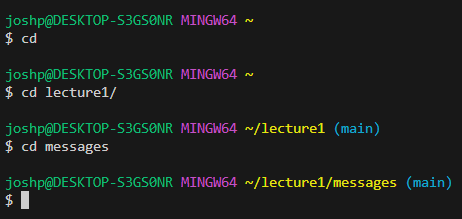

# Index
_**Hello World this is a text that is being written as part of the first lab in CSE 15L**_

# **Lab Report 1**

## cd command Examples 

* The  absolute path to the working directory before the command ran was at home.
* If we just cd with no arguments then it would still remain at home. But if we cd with argument lecture1 then we would move the working directory into lecture1. Then if we cd messages we then get the final working directory of `~/lecture1/messages`.
* The outputs of this command doesn't resort in an error unless the directory or path doesn't exist.
## ls command Examples

* The absolute path for the working directory used for this command was `~/lecture1`.
* The output from using ls without an argument are a list of the contents that are contain in the lecture1 directory. But when we try to ls directory lecture1 we get an error as our output because lecture1 doesn't exist inside of lecture1 and finally when we ls messages we get the contents inside of messages in the form of a list.
* The only time the command resulted in an error was when we tried to ls lecture1 into working directory `~/lecture1/` because lecture1 doesn't exist within lecture1. 
## cat command Examples

* The absolute path to the working directory before command cat ran was `~/lecture1/messages`.
* The output for using this command with no inputs is that it reads from standard output meaning if you type something then press enter then that will be concatenated. When using cat with messages as a arguement it would result in an error that says that the file or directory doesn't exist and when using cat en-us.txt es-mx.txt we get a concatenated output of the content inside those files.
* The only error was the error using cat messages because the working directory already has messages apart of it messages doesn't exist inside of messages.  
